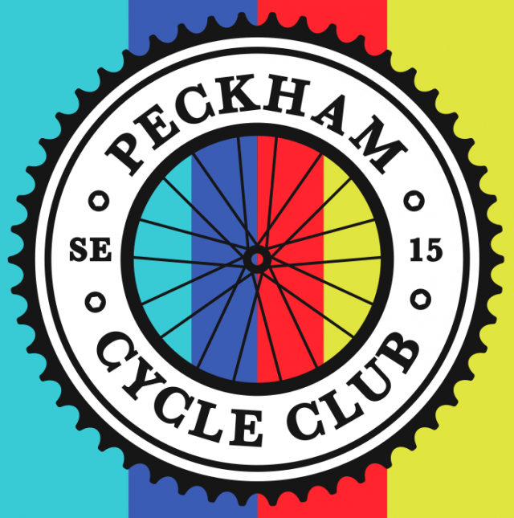

Hello Peckham Cycle Club!

# What's in this newsletter?

1. Raid Alpine 2020
1. Upcoming events

## Raid Alpine 2020

In 2020 Peckham Cycle Club will be tacking the Raid Alpine - an 750km ride from Thonon on the shores of Lake Geneva to Nice on the Côte d’Azur, taking in some of the most iconic alpine climbs, many of which regularly feature in the Tour de France.

The ridling will be split up into two chunks of three days with a rest day in the middle.  The plan is for the rest day to coincide with a high-alpine Tour stage, but to do this we will need to book the rest day accomodation as soon as the route is announced in mid-October as they sell out quickly.

The final dates also depend on the Tour being announced, but they are likely to pass through the alps early-mid July.

We're hoping to bring the cost for this in at around £650pp based on 8 nights B&B style accomodation with two adults sharing each room. Single room supliments will be available.  The payment schedule will be a £100 non-refundable deposit due by the start of October to secure your place and allow us to book the rest day accomodation.  Further payments will be requested in the new year and the final cost will depend on future exchange rates.

Logistics and will depend on how popular the ride is - a support driver will be possible with enough riders, otherwise we'll be packing light and porting our own luggage.

## Upcoming events

### Saturday 7th September - Swinduro Mountain Bike/Cyclo Cross race

A 25km off-road circuit in Swinley Forest in Berkshire (camping optional).  There will be a big basecamp with a laid back festival vibe - think street food, great coffee and beer, music and kids events.

https://www.swinduro.com

### Saturday 14th September - LVCC 50th Anniversary Crit

A perfect introduction to crit racing, the Lee Valley Cycling Club are celebratng their 50th birthday with a race at the VeloPark circuit that aims to be welcoming to beginners with no crit experience and will be followed by pizza and beer nearby.

https://www.britishcycling.org.uk/events/details/204713/Lea-Valley-50th-anniversary-Crit-Race

