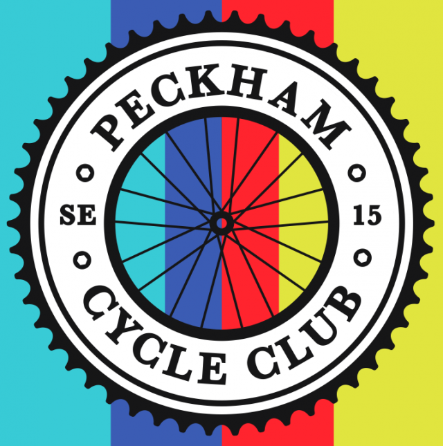

# What's in this newsletter?

1. Winter kit order
1. Club feedback
1. 2019 Volunteers
1. Orb bike lights

## Winter kit order

The sizing kit from Endura has arrived.  If you would like to try on any of our upcoming winter kit before ordering, Alex will be at the Beer Shop from 4pm this Sunday (25th November) and is negotiable on further dates.  We'll have S-XL sizes of:

 * Waterproof Jacket (Mens & Women's)
 * Winter Jacket (Mens)
 * Gilet (Mens & Women's)
 * Winter Jersey (Mens)

They are currently updating their women's Winter Jacket and Winter Jersey and will send us some samples when they are available.

## Club feedback

Please, please take five minutes and fill out the [2018 feedback form](https://docs.google.com/forms/d/e/1FAIpQLSdAum7KSIO4QTh-HgEvlbSjHdMUdAtBpzxuTNFQgtDWHBhlXQ/viewform). It's incredibly useful to find out where we are and what people think and will shape the direction of the club in 2019.

## 2019 Volunteers

Your club needs you! We have a variety of volunteer teams for 2019, including events, kit, charities, etc - [please use this form if you'd like to help the club be better in 2019](https://docs.google.com/forms/d/e/1FAIpQLSf1wylHqjxzcTwjsQessAtLovLkKDAcOvAN5c6K_Sk4zu4DuA/viewform).

## Orb bike lights

Last year Brixton Cycles rider Andrew Phillips had a successful Kickstarter to create the Orb Bike Light, a handy light/water bottle combo that sits in a bottle cage and gives 360 degree illumination.

Because some of our members supported him in the Kickstarter, he's very kindly offering £5 off Orb lights to all Peckham Cycle Club members.

Just use the code `Peckham5` at checkout: http://www.orb.bike
